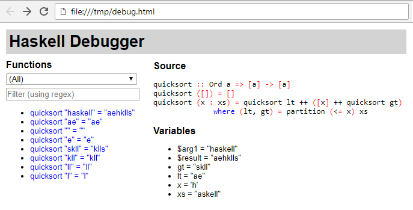

# Haskell Debugger [](https://hackage.haskell.org/package/debug) [](https://www.stackage.org/package/debug) [](https://travis-ci.org/ndmitchell/debug) [](https://ci.appveyor.com/project/ndmitchell/debug)

A library for debugging Haskell programs. To use, take the functions that you are interested in debugging, e.g.:

```haskell
module QuickSort(quicksort) where
import Data.List

quicksort :: Ord a => [a] -> [a]
quicksort [] = []
quicksort (x:xs) = quicksort lt ++ [x] ++ quicksort gt
    where (lt, gt) = partition (<= x) xs
```

Turn on the `TemplateHaskell`, `ViewPatterns` and `PartialTypeSignatures` extensions, import `Debug`, indent your code and place it under a call to `debug`, e.g.:

```haskell
{-# LANGUAGE TemplateHaskell, ViewPatterns, PartialTypeSignatures #-}
{-# OPTIONS_GHC -Wno-partial-type-signatures #-}
module QuickSort(quicksort) where
import Data.List
import Debug

debug [d|
   quicksort :: Ord a => [a] -> [a]
   quicksort [] = []
   quicksort (x:xs) = quicksort lt ++ [x] ++ quicksort gt
       where (lt, gt) = partition (<= x) xs
   |]
```

We can now run our debugger with:

```console
$ ghci QuickSort.hs
GHCi, version 8.2.1: http://www.haskell.org/ghc/  :? for help
[1 of 1] Compiling QuickSort        ( QuickSort.hs, interpreted )
Ok, 1 module loaded.
*QuickSort> quicksort "haskell"
"aehklls"
*QuickSort> debugView
```

The call to `debugView` starts a web browser to view the recorded information, looking something like:



You can look and play with the example results for various examples:

* [`quicksort "haskell"`](https://ci.appveyor.com/api/projects/ndmitchell/debug/artifacts/output/quicksort.html) as above.
* [`quicksortBy (<) "haskell"`](https://ci.appveyor.com/api/projects/ndmitchell/debug/artifacts/output/quicksortBy.html), like `quicksort` but using a comparison function and including a trace of `partition` itself.
* [`lcm_gcd 6 15`](https://ci.appveyor.com/api/projects/ndmitchell/debug/artifacts/output/lcm_gcd.html), computing `lcm 6 15 ^^ gcd 6 15`.

## Build tool: `debug-pp`

`debug-pp` is a Haskell source preprocessor for streamlining the `debug` instrumentation of a module or a package. It performs the steps described above automatically. That is:

* append an import for the `Debug` module,
* wrap the body in a `debug` splice using a TH declaration quasiquote, and
* add the required GHC extensions.

To instrument a module, add the following pragma to the top of the file:

```haskell
{-# OPTIONS -F -pgmF debug-pp #-}
```

To instrument an entire program, add the following line to your stack descriptor, or if you don't use stack, to your cabal descriptor:

```haskell
ghc-options: -F -pgmF debug-pp
```

In both cases you will also need to modify your Cabal descriptor in order to

* add a dependency on the `debug` package
* (optional) add a build tool depends on `debug-pp` (required Cabal 2.0) :

```haskell
Library
  ...
  build-tool-depends: debug-pp:debug-pp
```

### Configuration

`debug-pp` tries to find a config file in the following locations (from higher to lower precedence):

1. `.debug-pp.yaml` in the current directory (useful for per-directory
   settings)
2. `.debug-pp.yaml` in the nearest ancestor directory (useful for
   per-project settings)
3. `debug-pp/config.yaml` in the platform’s configuration directory
   (on Windows, it is %APPDATA%, elsewhere it defaults to `~/.config` and
   can be overridden by the `XDG_CONFIG_HOME` environment variable;
   useful for user-wide settings)
4. `.debug-pp.yaml` in your home directory (useful for user-wide
   settings)
5. The default settings.

Use `debug-pp --defaults > .debug-pp.yaml` to dump a
well-documented default configuration to a file, this way you can get started
quickly.

The configuration options include:

* Exclude modules by name.
* Instrument the `main` function with `debugRun`.
* Choice of backend.
* In the case of the `Hoed` backend, whether to enable the automatic deriving of `Generic` and `Observable` instances.

## Debug backends

This package offers two alternative backends for generating the debug trace:

* `import Debug`

   This is the default backend, which relies on `Show` instances to observe values strictly. If your program relies on laziness, it will probably crash or loop.

* `import Debug.Hoed`

   A new experimental backend built on top of [Hoed](https://github.com/MaartenFaddegon/Hoed/pulls). **Requires GHC 8.2 or higher**

   Fully lazy, able to observe function values and provide call stacks: [example](https://rawgit.com/pepeiborra/debug-hoed/master/example/quicksort.html). The instrumentation is simpler, so it is known to work in more cases. It relies on `Observable` instances  which are derivable (the TH wrapper can take care of this automatically). Note that it will probably not work in multi threaded environments yet.

## Requirements

* Polymorphic functions must have type signatures, otherwise GHC will fail to infer an unambiguous type when annotated for debugging.
* Types under observation must have `Show` (or `Observable`) instances, otherwise they will fall back to the default `<?>`.
* Calling the debugged function inside GHCi records the results for viewing inside the UI.

The function can be called multiple times with different parameters, and the results of each
individual run can be selected inside the UI.

## Notes

* You can create multiple `debug [d|...]` blocks inside a module and you can also put more than one function inside a single block.

A function being debugged can refer to another function also being debugged, but due to a limitation
of Template Haskell, the definition of the function being called must occur above the point of its
reference in the source module.

Due to constant applicative forms (CAFs) distorting the debug trace, it is not advisable to run the debugger twice in the same GHCi session.

## Limitations

This tool is quite new, so it has both limitations, places it is incomplete and bugs. Please report all the issues you find and help us make it better.

## Alternatives

For practical alternatives for debugging Haskell programs you may wish to consider:

* [GHCi debugger](https://downloads.haskell.org/~ghc/latest/docs/html/users_guide/ghci.html#the-ghci-debugger), simple imperative-style debugger in which you can stop a running computation in order to examine the values of variables. The debugger is integrated into GHCi. Robust, reliable, somewhat difficult to use.
* [Hood](https://hackage.haskell.org/package/hood) and [Hoed](https://hackage.haskell.org/package/Hoed), a value-based observational debugger with a difficult user interface, deals well with laziness.
* [Hat](https://hackage.haskell.org/package/hat), good ideas, but I've never got it working.

Compared to the above, `debug` stresses simplicity of integration and user experience.

## FAQ

### Q: `debugView` fails talking about Wine?

A: If you get `wine: invalid directory "/home/f/.wine" in WINEPREFIX: not an absolute path` when running `debugView` that means `xdg-open` is handled by [Wine](https://www.winehq.org/). Fix that and it will work once more.

### Q: `debugView` fails with "error: Variable not in scope: debugView"?

A: Explicitly load the Debug module in GHCi via `:m + Debug`
